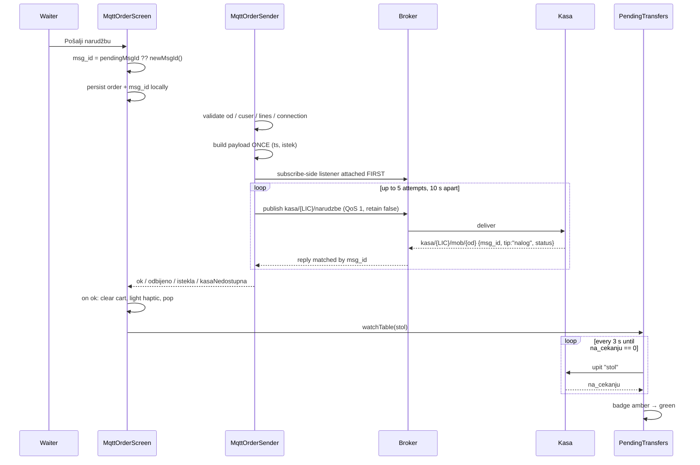

# Slanje narudžbe na kasu (MQTT)

How an order travels from the waiter's tap to the kasa's order, what can go
wrong at each step, and why the code is shaped the way it is.

Companion to [`mqtt-connection-lifecycle.md`](mqtt-connection-lifecycle.md),
which covers the connection this all rides on.

---

## 1. In one paragraph

The waiter builds an order in a local in-memory cart. On **Pošalji narudžbu**
the app generates a `msg_id` (UUID v4), builds a JSON payload **once**, and
publishes it to `kasa/{LICENCA}/narudzbe` at QoS 1 with **retain false**. It
then waits up to 10 seconds for a reply on its own private topic
`kasa/{LICENCA}/mob/{od}`, matched by that same `msg_id`. No reply means resend
**the identical payload** — up to 5 attempts. The kasa remembers every `msg_id`,
so a resend can never book the order twice. On acceptance the local order is
dropped and the app starts watching the table until the kasa actually moves the
lines onto it, which is a separate, slower step.

---

## 2. Prerequisites

A send can only succeed if all of these hold. The first three are checked in
code before anything is published.

| Requirement | Where it comes from | If missing |
|---|---|---|
| Device provisioned | QR scan, persisted as `mqtt_qr_code_v1` | `od` is null → refused locally |
| `od` is topic-safe | 1–64 chars, no `/ + #` | refused locally (kasa would drop it **silently**) |
| Waiter signed in | `cuser` from `podaci/korisnici` via PIN | refused locally |
| Cart not empty | — | refused locally |
| Broker connected | auto-connect at launch/resume | reported as "Nema veze s kasom", order kept |
| Subscribed to `mob/{od}` | done at connect, before any send | reply would be lost |
| Kasa running with Pelion Order, holding the DB | kasa side | no reply → "Kasa nedostupna" |

The `od` check matters more than it looks: per the protocol doc (4.3) the kasa
**silently discards** an order whose `od` is empty or malformed. No reply, no
error — so the app validates it itself rather than waiting 50 seconds to learn
nothing.

---

## 3. The path



### Step by step

1. **Trigger** — `_send()` on the order screen, or **Pošalji narudžbu** on the
   details screen. Both route through the same `_sendOrder()`, so there is one
   code path and one set of rules.

2. **msg_id** — `_cart.pendingMsgId ?? newMsgId()`. It is written to the
   per-table store *immediately*, before any network call, so a retry after the
   app is backgrounded or the screen is left still reuses it.

3. **Validation** — the four local checks from §2. Failing them returns without
   publishing anything.

4. **Grouping** — if *Grupiraj artikle pri slanju* is on, identical lines are
   merged (`groupCartLines`). Lines only merge when the article, the remark
   codes **and** the free text all match; the kasa never merges anything itself,
   so what we send is literally what the kitchen ticket shows.

5. **Payload built once** — including `ts` and `istek`. Rebuilding it per
   attempt would push the expiry forward on every retry, which would defeat the
   point of an expiry.

6. **Listener before publish** — the reply stream is subscribed *before* the
   first publish. The kasa can answer in milliseconds; attaching afterwards
   risks missing it and waiting the full 10 s for nothing.

7. **Publish** — `kasa/{LICENCA}/narudzbe`, QoS 1, **retain false**. Retain
   would be a serious bug: a retained order is replayed to every kasa that
   subscribes later, booking it again.

8. **Wait / resend** — 10 s per attempt, 5 attempts, the same bytes each time.

9. **Apply the outcome** — see §6.

---

## 4. The payload

```json
{
  "msg_id": "8f14e45f-ceea-467a-9f1b-9b2c3d4e5f60",
  "od":     "53B5079F96A188F16127D962-ORDERMAN-1",
  "ts":     1788357157802,
  "istek":  1788357757802,
  "stol":   6,
  "cuser":  "2",
  "stavke": [
    { "cartikl": 123, "kol": 2 },
    { "cartikl": 456, "kol": 1.5,
      "napomene": ["1", "4"], "napomena_tekst": "bez luka;extra ljuto" }
  ]
}
```

| Field | Notes |
|---|---|
| `msg_id` | UUID v4, generated with `Random.secure()`. The idempotency key. |
| `od` | Our MQTT client-id — the whole scanned QR string. Also the last segment of the reply topic. |
| `ts` | Epoch **milliseconds**, `long`. Not a formatted datetime. |
| `istek` | `ts + 10 min`. The kasa tolerates 5 minutes of clock skew. |
| `stol` | Number. (The kasa echoes it back as a *string* in query replies.) |
| `cuser` | The waiter's code from `podaci/korisnici` — not their name. |
| `kol` | Integer when whole, otherwise decimal with a dot. |
| `napomene` | Remark **codes** (`cnap`), never names. Omitted when empty. |
| `napomena_tekst` | Free text, notes joined with `;`. Omitted when empty. |

**Napomene encoding.** The kasa translates codes to names and joins them with
`;`, then appends the free text. So `["1","4"] + "bez luka;extra ljuto"` prints
as `KRASTAVCI;LOOK;bez luka;extra ljuto`. Each custom note is sanitised first —
`;` and `,` typed by the waiter become spaces — so only our own joins can create
separators.

---

## 5. Idempotency — the part that matters

QoS 1 means *at least once*: the broker may deliver the same order twice, and we
deliberately resend it ourselves. The kasa records every `msg_id`, and a repeat
is answered with the original reply rather than booked again.

That guarantee only holds if the app is disciplined about the id:

- **Same content → same id.** Every retry, including one made minutes later
  after leaving the screen, reuses the stored id.
- **Changed content → new id.** `MqttCart._touch()` clears `pendingMsgId`, and
  *every* mutating method routes through it — add, remove, quantity, remarks,
  notes, and reorder. So editing the cart makes the next send a genuinely new
  order, automatically. Nothing relies on a developer remembering to clear it.
- **Expired → new id.** `istekla` sets `needsNewMsgId`, because the kasa has
  discarded that order and reusing the id would just replay the expiry.

---

## 6. Outcomes

| Outcome | Trigger | Order kept? | `msg_id` | Waiter sees |
|---|---|---|---|---|
| `ok` | `status: "ok"` | dropped | — | nothing: light haptic, screen pops, table badge |
| `odbijeno` | `status: "odbijeno"`, or an unrecognised status | kept | **kept** | kasa's `poruka` |
| `istekla` | `status: "istekla"` | kept | **cleared** | "Nalog je istekao — pošaljite ponovno." |
| `kasaNedostupna` | no reply after 5 attempts, or not connected | kept | kept | "Kasa nedostupna — narudžba je spremljena…" |
| `neispravno` | local validation failed | kept | cleared | the specific reason |

An **unrecognised** status is treated as a rejection, never as success. Silence
is never read as acceptance.

On success there is deliberately **no snackbar** — the screen returns to the
floor plan and the table gains its badge, so a message would only repeat what is
already on screen. A `lightImpact` haptic confirms it instead.

---

## 7. After acceptance: the transfer is a second, slower step

`status: ok` means **the kasa received the order**, not that the items are on
the table. The kasa moves them across on its own schedule — nominally every 3 s,
but observed to take minutes.

So on acceptance the app calls
`mqttPendingTransfersProvider.watchTable(stol)`, which queries **that one table**
(`kasa/{LICENCA}/upiti`, `tip: "stol"`) every 3 seconds until `na_cekanju`
reaches 0, then clears the mark. The floor plan shows:

- 🟠 **amber arrow** — something outstanding: a local draft never accepted, or
  accepted but not yet transferred
- 🟢 **green arrow** — the table has an order and everything has landed
- no badge — nothing ordered here

This can't come from `podaci/stolovi_stanje`: that retained payload carries only
`stol / cuser / konobar / iznos / stavki / kupac`, nothing about a transfer in
flight. But we never need to query all tables — a transfer is only pending
because *this device* just sent something, so the watch list is normally one
table. It gives up after 5 minutes so a wedged kasa cannot leave the app polling
all shift.

---

## 8. Replies share one topic

`kasa/{LICENCA}/mob/{od}` carries **both** order replies (`tip: "nalog"`) and
table-query answers (`tip: "stol"`). The router matches only `"stol"`
positively; everything else goes down the order path.

That asymmetry is deliberate. `tip` on order replies was added to the kasa
recently, so a kasa build that predates it sends none at all — and a strict
positive match on `"nalog"` would silently break order sending. Pairing by the
`msg_id` we generated is the real guarantee; `tip` only chooses the stream.

---

## 9. Timings

| | Value |
|---|---|
| Reply timeout | 10 s |
| Attempts | 5 (worst case ≈ 50 s) |
| Order validity (`istek`) | 10 min from `ts` |
| Clock skew tolerated by kasa | 5 min |
| Transfer watch interval | 3 s |
| Transfer watch give-up | 5 min |
| Table query timeout / attempts | 6 s / 2 |

The query is given fewer attempts than the order on purpose: nothing is lost by
giving up on a read, and the waiter is standing there waiting.

---

## 10. Where the code lives

| File | Responsibility |
|---|---|
| `mqtt/presentation/mqtt_order_screen.dart` | `_sendOrder()` — msg_id lifecycle, outcome handling, UI |
| `mqtt/data/mqtt_order_sender.dart` | validation, payload, retry loop, outcome mapping |
| `mqtt/data/mqtt_service.dart` | `publishOrder()`, reply-topic routing, subscriptions |
| `mqtt/models/mqtt_order_reply.dart` | reply parsing, status enum |
| `mqtt/state/mqtt_cart.dart` | the cart; `_touch()` invalidates `pendingMsgId` |
| `mqtt/state/mqtt_orders_provider.dart` | per-table store of lines + pending msg_id |
| `mqtt/state/mqtt_pending_transfers_provider.dart` | post-acceptance transfer watch |

---

## 11. Known sharp edges

- **`ts` must stay a long.** A kasa build once parsed it with
  `java.sql.Timestamp.valueOf()` and rejected every order with *"Timestamp
  format must be yyyy-mm-dd hh:mm:ss"*. The contract is epoch milliseconds.
- **A malformed `od` produces silence, not an error.** Hence the local check.
- **Success is not delivery.** See §7 — a waiter who checks the table
  immediately may not see their items yet.
- **The client-id must be unique per device.** Two phones provisioned with the
  same QR share an `od`, which means one MQTT client-id and one reply topic:
  the broker disconnects one, and replies cross between them.
